# LAB-1
## ✅ Results
### Install awscli on ec2
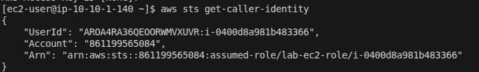
---------------------------------------

### Policy Added

----------------------------------------
### Confirm policy to view Buckets from EC2
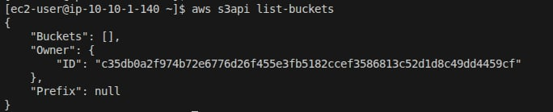

# LAB-2
## ✅ Results
### Confirm Nginx is installed
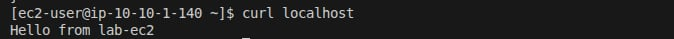
-----------------
### Access through browser
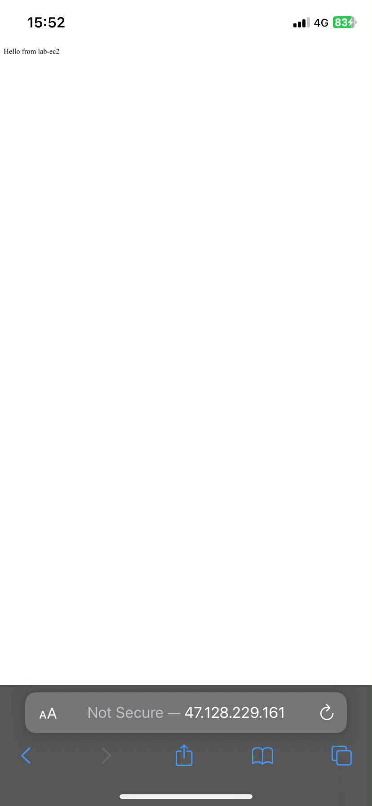

### EBS mount in EC2
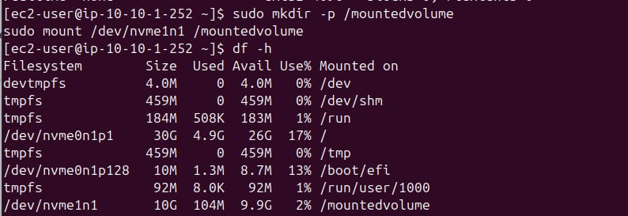

### Create 2  private subnet , 2 public subnet , 1 natgateway , 1 internet gateway

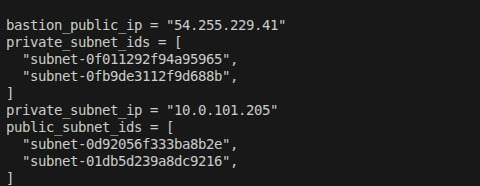

- Internet Gateway for public EC2
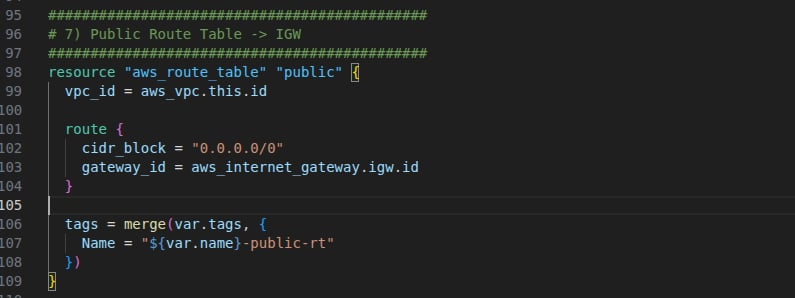

- NAT gateway for private EC2

- Setup inbound and outbound rules for each EC2
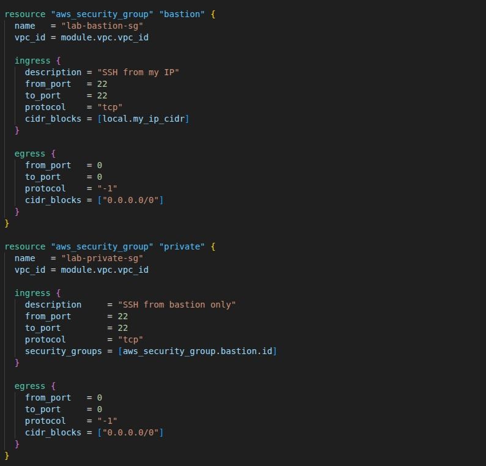

- SSH into public EC2
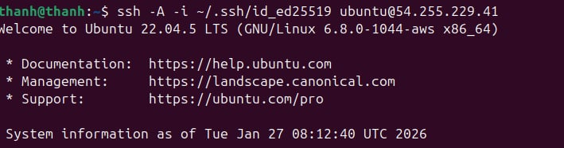
- SSH from public one to private one
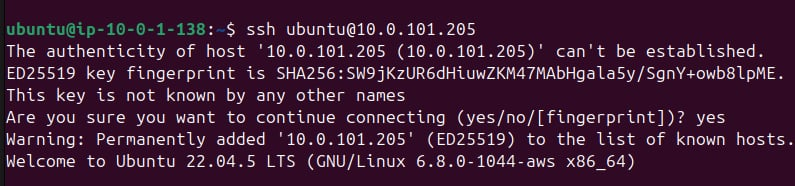

# LAB-3
### EBS mount in EC2

# LAB-4

### Create ALB and ASG , bucket attached to ASG
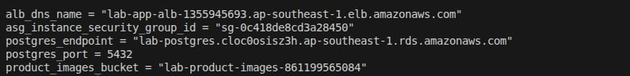

### Access from browser through ALB's DNS
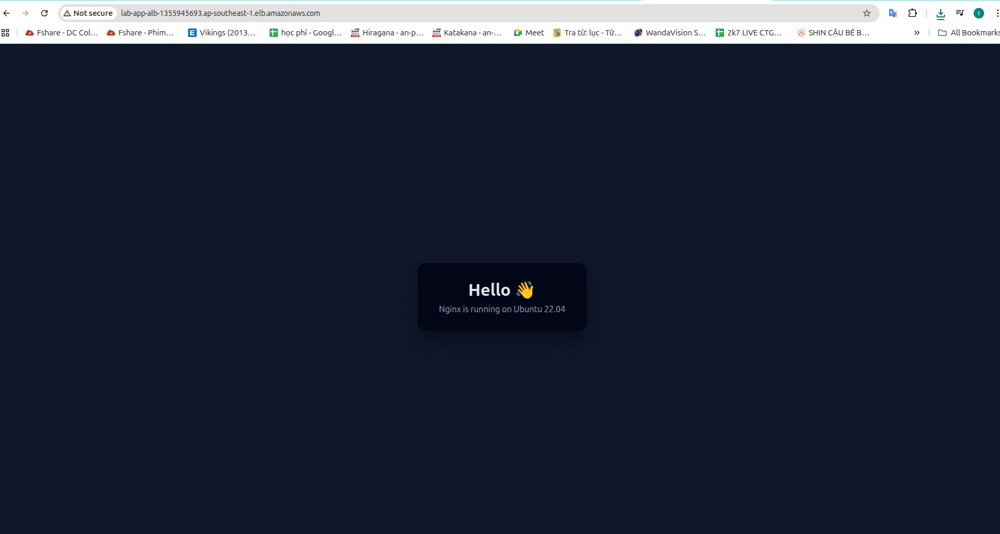